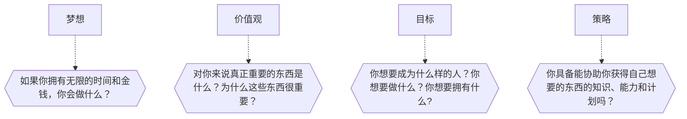

[TOC]

-------

### 变得富有的机会

我们实现梦想的绊脚石是什么？我们实现一切渴望的阻碍是什么？当然，大多数人都生活在一个不利于致富的客观环境中。

- 政府是一本反面教材，年复一年的大量举债
- 教育体制也没有为这些问题给出答案
- 学不到如何使自己经济独立
- 谁能教会我们如何变得富有
- 得到的关于创造财富的建议也是微乎其微
- 社会倡导过度消费
- 缺乏这方面的良师益友

因此，许多人在生活中失去了一些东西，这些东西被我们视作我们与生俱来的权力，即**幸福和富有。**

### 特殊的经历造就了我们

我们每个人在生活中都有过一些对我们影响颇深的经历。这些具有导向作用的经历改变了我们的世界观和我们对人类、机会、金钱以及世界的看法。进而使我们的生活变得更加美好或者更加艰难。

因为 XXX，我下定决心，XXX。

### 仅有决心是不够的

我希望一切都能变得更好，事态也终会朝着这个方向发展的。但如果我们只是徒有希望而不做努力的话，那什么都不会发生。**希望是一种智能镇定剂，一种绝妙的自我欺骗。**

古老的格言自由其道理：“所有的傻瓜都生活在希望和等待之中。”

### 我们的价值观和目标必须一致

我曾经感到绝望：我明明日进斗金，怎么还负债累累？当我终于找到这个问题的答案时，我吃了一惊。我内心深处从不认为金钱是善物。我亲手毁了自己的成功。

而我，一方面想获得福报，就会想贫穷是福；另一方面，我又想变得富有，因为我憎恶贫穷。

两个不同的价值观将我引向了两个不同的方向。只要没消除我的价值观冲突，我就总会站在两个方向的分歧点上。

### 乐观主义和自信

**乐观主义让你看到事物的积极面，而自信给你一种战胜事物黑暗面的信心。**生活并不是一支只由美好明快的曲调组成的交响乐，它还有黑暗低沉的曲调。不过自信的人在面对困境时不会胆怯。

**自信指的是，一个人在自身经历的基础上，知道他遇事可以依靠自己。**一个自信的人不会因阻碍而愤懑，因为他知道他一定会破除万难达到目标。

你的财务状况对于建立自信极为重要。**你的财务状况应该成为一个你不惧怕任何阻碍的证明。**

你不能让自己的财务状况破坏你的自信程度。没有自信的生活只能叫作生存。你永远都不会知道自己的潜能。你从不冒险，从不成长，从不应对处境做出反抗，从不充分开发自己真正的潜能。**一个没有自信的人，只是一个一事无成、一无所有的无名小卒。**

所有这些都不是乐观主义，而是自信。只需看一眼账户余额，你就知道你的财务状况是你生活的保障。只需看一眼账户余额，你就立刻充满一种来自自身能力的安全感。

这正是本书的主题，即：管理你的财务状况，使它服务于你，而非给你带来麻烦。金钱可以使你生活艰难，也可以使你生活轻松。

### 你处于什么样的状态中

如果你想获得不一样的结果，那你就必须有所行动：你必须改变自己的方式，首先需要改变的便是你的思维方式。

**你的思维方式铸就了你今天的样子。这样的思维方式却不能让你变成你想成为的样子。**

### 金钱是善物

我之所以能如此之快地达成这一目标，是因为我的梦想、价值观、目标和策略都是一致的。

不管你相不相信，金钱确实改变了我生活中的许多东西。金钱不会解决你的所有问题，它也绝不是万能的。但是，缺钱却能使你的幸福蒙上一层阴影。有了金钱，你在处理问题的时候便能尝试多种方式。

### 生活的 5 个领域

我将生活简化为 5 个领域：健康、财务、关系、情感和人生意义。5 个领域都同等重要。

健康是革命的本钱。无法控制情感的人，也无法完成自己的既定计划。良好的人际关系就犹如盐对于汤的重要性。关于人生意义，我指的是做自己认为有趣的、符合自己才能的、有益于他人的事情。财务状况也属于此类范畴。**永远不要为了金钱去做一些无趣的事情。**所以你需要的是财务自由。

为什么人们想在短期内变得富有？因为他们想获得足够的能为他们服务的金钱。因为他们**想拥有一台赚钱机器，而非穷其一生当一台赚钱机器。**因为他们想拥有足够的资金，以过上一种收支平衡的生活。

你知道为什么大多数人都不去做自己真正感兴趣的事情吗？因为他们缺钱。然后各种恶性循环。

解决方法是：**将你的事业建立在你最大的爱好之上。**用你的爱好来赚钱。花点时间分析一下，你真正感兴趣的是什么、你的才能在哪些方面，之后你才有可能从事一份自己既感兴趣又能赚钱的工作。

“整天工作的人是没有时间来赚钱的。”

### 优化自己还是削弱自己

我们需要时间来了解自己，找出自己感兴趣的东西。只有在做一些使自己充满热情和力量的事情时，我们才是真正处于最好的状态，才能使金钱滚滚而来。

我们需要时间看清自己的天赋，并将天赋发展成能力。

我们需要时间来谱写人生剧本，并使之成为一部巨作。

不花时间做这些事的人，就是在浪费生命。

因此，每个人都必须在生活中明确地做出决定：是想优化自己还是削弱自己。

优化自己指的是，学习如何以最佳的方式来运用时间、方法、才能、金钱以及与他人合作，其目的是达到最优结果。如果你想优化你的生活，你就应该不断努力成为你能成为的最优秀的人。

相反，大多数人都毫无计划地生活着，同时也削弱了自己。他们尝试**过一种得过且过的生活。**

### 规划是关键

这世上只有两种可能性：不是你自己规划你的生活，就是别人来规划你的生活。

为什么这么多人都无法成功执行他们的规划，有一个很简单的原因：他们没有将自己的梦想、目标、价值观和策略联系在一起。

你的行动准则应该以梦想、目标、价值观和策略这 4 根支柱为基础，你的财富也应建立在你的行动准则之上。因为你一生中能否有所作为，并不直接取决于你铁一般的行动准则，而是与你的梦想、目标、价值观和策略直接相关。

-------
