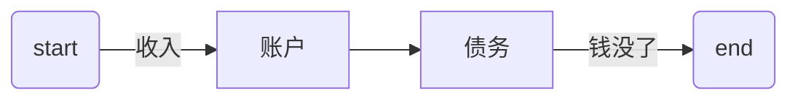
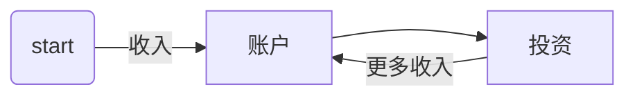

[TOC]

-------

## 第一部分：原则

一般来说，以下讲到的这些原则具有普遍适用性。本书的目的并不是给你一些具体的投资建议。因为这样不仅缺乏远见，还相当危险。在如今快节奏的时代，产品和机遇都瞬息万变。因此，我接下来要讲的内容只着眼于基本原则和最重要的决定。

### 学会区分

自然界中的每个地方都充满着各种各样的生物，一部分无害且有益，另一部分对我们很危险，甚至有一些具有致命的危害。

生命健康遭遇的这种情形，你的金钱同样也会经历。有些投资让你收益丰厚，有些却使你血本无归。不会进行正确区分的人，将会很危险。

为了生存，我们必须学习。为了实现财务自由，我们必须学习。更甚至**为了保持财务自由，我们还是必须学习。学习是为了学会区分。一旦能够**识别差异，你就可以做出明智的决定。

接下来提出几个重点的区别。你应该对这几条区别进行思考、消化，并转化成你自身的理财能力。因为你知道什么才是适合自己的计划，所以你可以快速且正确地做出决定。

关键的区别在于：
1. 投资和投机的区别；
2. 负债和投资的区别；
3. 三种投资类型的区别；
4. 普通投资者和投资家的区别。

### 原则一：识别什么时候投资，什么时候投机

一笔投资是从最初开始就会定期获得收益的。只要没有获得收益，那么你就只是投入了金钱，但并不是进行了投资。我的教练说：“投资者能从投资项目中定期获得收益。谁要是在转卖时才获得收益，那么他就不是投资者，而是投机者。”

#### 投机

投机本身没有什么错。

投资者赚钱，投机者**赢钱**。再强调一次：投机不一定是坏事。**坏的是，你实际上做着投机的行为，却认为自己在进行投资**。你必须清楚，你究竟把钱投到了哪里，你不应该期待并不可能的定期收益。

#### 股票和股票基金

请允许我再重申一次，在投机活动中，你不应该期望去获得定期的收益。你可能会遇到糟糕的意外情况。

购买股票和股票基金依旧还是投机，并不是投资。

#### 做什么

关于投机，这里还有一个重要的限制条件：如果你购买股息稳妥的股票和基金，那么你可以排除掉大部分的偶然因素。股息，就是定期获得的资金支付，也就是收入。以获取股息为目的而持有股票则属于投资。

此外，有两种经典类型的行为属于投资：投资不动产和创办公司。

想要学会如何巧妙地投资，必须付出时间和精力。而不愿为此付出时间的人，投资基金是唯一的选择。但这样的话，你又需要保持足够的现金储备。

#### 投机者也是商人

严格来说，投机者和商人一样。投资者为了持有金钱而购入产品，从一开始就能获得收益。而商人以尽可能低的价格购入产品，希望能够高价卖出。

两者都需要拥有相关知识。

商人必须知道买入和卖出的最佳时机。这不一定和买入产品的实际价值有关，**只要能以高出买入价格的售价卖出就足够了**。换句话说，商人必须正确地评估市场。

相反，投资者就必须对不动产或公司进行评估，并预估可能产生的利润率。

### 原则二：区分债务和投资

金钱流向何处？流向你还是远离你？如果金钱远离你，这就是一种负债。如果金钱流向你，那这便是投资。

**债务情况：**

**投资情况：**

现金的流向说明一切。负债使金钱最终离你而去，投资则增加你的收入。

#### 自住房又是什么情况

还记得我说过我父母把房子看作投资吗？一处用于自己居住的房子或者公寓其实并不是投资，而是债务。

很多人不是说“住房是最好的投资”吗？然而你想想，都是谁在这样说。谁在散布这个谣言？大部分都是信贷机构和银行。

#### 当你还清房贷时，情况又如何

对大多数人而言，还清房贷都需要 25 年至 30 年的时间。然而即使还清了贷款，也不会从房子中获取收益，只有卖掉房子时才会。

就算你还清了房贷，你的房子还是一种债务。因为你需要不停地缴一些费用：税费，保险费，维修费，装饰费，置物费。最好不要把房子看作投资资产，而应看作奢侈资产。把房子看作投资资产让你安心，而奢侈资产是很费钱的。

#### 首先进行投资

我不反对买房。恰恰相反，我认为一套房子或者公寓能为我们提供一定的生活质量。房子是一种奢侈品，却是一种有意义的奢侈品。关键在于**什么时候买房**。是先投资，还是先负债。

如果你在投资之前就先买房，你也许就没有足够的余钱来投资了。相反，如果你选择先投资，你也许会因此获得额外收益，从而轻松购买一套房。

### 原则三：确定你的资产类型

你必须确认你有哪些可供选择的资产类型。这是根据基本原则进行投资的唯一途径。财务投资只有三个主要类别：
1. 货币资产；
2. 有形资产；
3. 赌博。

货币资产投资即以钱投钱。
缺点在于：通货膨胀和税费占去了大部分本就微薄的收益。
优点在于：这项投资相对比较安全。你当然不应该放弃它们。

在有形资产投资中，你将资金转换为固定资产——比如不动产，投入企业投资份额、股票及股票基金等重大资产。
有形资产风险较高，对相关知识要求程度更高。但也会带来高回报。

赌博是你在玩你的钱。我的教练说过：“赌博只能作为娱乐。绝对不能把赌博和投资混淆。”我的建议是：远离赌博，直到你真正清楚自己在做什么。

为什么需要做此区分呢？答案很简单：为了建立起投资的系统性。你绝对不能随意地进行投资或花钱。

你需要确定的是，你希望将多少钱投入货币资产中，多少钱投入有形资产中。问题**不在于**哪一种资产更好。

真正的问题在于：**我要怎样分配手中的资金**。

关于这个问题，我无法给出简单的答案。这取决于至少 4 种因素：
1. 你的目标是什么？
2. 目前你手上有多少资金可以投资？
3. 你准备承担多大的风险？
4. 你的年龄？或者，你什么时候需要支配多少钱？

### 原则四：有形资产完胜货币资产

长期以来，有形资产投资一直都胜过货币资产投资。主要原因是通货膨胀。当你投入一部分金钱在货币上，这笔货币的价值会随着通货膨胀而贬值。同样多的一笔钱，今天能买到的东西和 10 年前就完全不同，因为所有东西都涨价了。

也就是说，把钱存入储蓄账户的人，越存越穷。

通货膨胀吞噬了你的钱，因为所有东西都变贵了。当物品涨价，你的有形资产也跟着涨价。要是你投资了不动产，它的价值便会升高。股票也是如此。如果所有的物品都涨价，那么你的有形资产也会涨价。

#### 真正的通货膨胀率

72 / 通货膨胀率 = 货币资产对半贬值所需的年数

#### 通货膨胀是你的朋友

总之，我们可以说，通货膨胀是你金钱方面的敌人，也是你有形资产方面的朋友。好消息是：在这种相互关联的影响下，你的存款如何贬值，有形资产也将会如何升值。

简单地说，**在货币资产上被称作通货膨胀的情况，在有形资产中被称为升值**。你要是投资有形资产，则不必担心会出现通货膨胀。因为同样是通货膨胀，让你的金钱贬值，也让有形资产升值。

### 原则五：你必须承担风险

自由和安全是相互矛盾的。追求自由的人和看重安全的人完全就是两种人。后者愿意牺牲自由来换取更多的安全。追求的财务安全程度越高，他们失去的财务自由也就越多。

#### 安全不是绝对保障，自由不是无拘无束

追求安全的人，首先是想保证不亏损。他们对于亏损的恐惧感远远高于想要赚钱的欲望。相反，追求自由的人则想要赚钱。这类人赚钱的欲望就远远超过对亏损的担忧。我的教练常说：“投资不是为了不亏钱，投资就是为了赚钱。”换句话说就是，投资你的存储资金来增值，而不是越存越穷。

对安全的担忧，对人们是个很大的劣势。追求绝对安全的人往往会恐惧。追求安全的这类人正是最胆怯的这些人。他们的世界总是黑暗且充满危险的。过分沉迷于安全的人，世界观总是消极的。他们总是会发现新的危险。

仔细想想，其实安全从来不是绝对的保障。因为如果你只将金钱用于稳定的储蓄，可以肯定的一点是：通货膨胀和税费将会蚕食你的钱。一个只选择“安全”储蓄的人，多年后，和愿意冒险的投资者相比，他可以支配的金钱肯定会少得多。

但是自由也并非无拘无束。自由是要付出代价的：勇气、毅力以及时刻准备着犯错。自由的代价绝不只是一点点：不时出现的恐惧，怀疑，很少得到他人的理解······但是只要你鼓足勇气，敢于去做，拥有面对错误的意志力，并且学会直面失败，那么你将能够获得只有少数人能体会到的自由。

#### 失败

胆敢冒风险的人，也一定要准备好经受挫折。如果有人说：“这对我来讲风险太大了。”那么他其实同时也在表达这一层意思：“我不想犯任何错误。”“我觉得犯错误没有任何好处。”

真正的投资者清楚：损失也属于盈利的一部分。正如没有心碎过的人，不懂如何真正地去爱。也没有哪一位富有的投资者没有经历过亏损。但我却认识很多穷人在投资上从未亏损过······

想要彻底规避风险是一件危险的事情。因为这样你会失去很多金钱，远比你能挣到的还要多。只有敢于尝试新事物，才能长期盈利。敢于尝试新事物的人，肯定会犯错。在这一点上，犯错是很重要的：它让我们提高注意力，并且保持谦虚。谦虚的人能比自以为无所不知的人学到更多东西。

关键在于我们如何看待自己犯下的错误。我们将其看作一种罪责？还是看作未来的负担？还是看作对未来的一项投资？

#### 结论

这有什么实践意义？你应该把一部分资金用于货币资产，包括定期存款账户、货币基金和债券。但是，另外一半的资金要用于有形资产投资。如果你没有时间投资股票，那么你可以选择股票基金。如果你想努力成为一名投资者，就还需要投资不动产和公司。

### 原则六：分散投资

这条原则是重中之重。不论你想选择一条快捷的路，还是缓慢的路，你都应该：分散投资。

没有人能预知未来。因为不能，所以几年后我们才能回头看到哪一些投资是最成功的。因此，除了分散投资，没有其他更好的办法了。

我们不知道接下来 10 年将会面临的是通货膨胀还是通货紧缩，经济繁荣还是经济衰退，或者甚至是大萧条。因为无法预知，所以一部分钱应该用来投资货币资产，另一部分投资有形资产。在货币资产投资中再分散资金。我们也不知道哪些有形资产走势最好。因此，在这上面也要进行分散投资。

### 原则七：投资家和普通投资者是有区别的

普通投资者关心的是平均水平。

普通投资者大多只有在牛市时才能盈利。熊市时他们就只有一个选择：等待市场好转。

投资家在不景气的时段里并不会无所事事地等待，他会继续进行交易。这需要很多的时间以及专业知识来支撑。

他的交易不可能总是一帆风顺，但他能从错误中汲取经验教训，永远不会因此而气馁。投资家把犯错看成是成功的必要部分。普通投资者则不喜欢犯错，他们将其看作个人的失败。

#### 对冲基金

富有的投资家通常都持有对冲基金。就如同栅栏把羊群圈住，防止它们跑开一样，对冲基金（栅栏）能防止投资遭受巨大的损失。对冲基金能够在行情低迷期借助期权使自身得到保障。对冲就像是一份保险，一份针对损失的安全保护。

当然，也不存在完全的安全保证——即使人们一直认为对冲基金是最明智的选择。实际上，由于复杂的杠杆作用，投资风险甚至会上升。普通投资者认为期权具有非常高的风险。事实也确实如此。但是真正的投资家认为：“不为投资行为加以防护措施，风险更大。”

此处讨论的并非什么是“正确的”。任何事物都有两面性。此处的重点只有一个，那就是真正的投资家坚持的原则：不要只是等待，而应该更多地主动出击；不要只是满足现状，而要去寻找新的道路。

#### 两条道路······

在人生以及本书中，我们一直都面临着在两条道路之间进行选择：一条缓慢的路和一条快速的路。

你如果满足于在 20 年时间达到财务自由，那么可以选择走一条缓慢的道路，一条处于平均水平的道路。这并没有什么不对。这只是你自己的人生规划、价值观以及优先考虑的事。这是你自己的选择，你自己感觉舒服就好。

反之，如果你选择走一条快速的路，那你必须比一般水平的人更优秀。你要么比别人赚得多很多，要么创办一家公司，或者你作为投资家并取得非一般的成就。

这三种情况中的任意一种，都需要你投入大量的时间，学习，学习，再学习。

记住：有教练带领你学习，会事半功倍。

## 第二部分：重要的决定

决定的本质在于，你无法同时兼得鱼和熊掌。你必须从两个可能性中做出一个决定。

问题一：什么时候才是负债的最佳时机？

问题二：你想投资还是投机？

问题三：你打算独自投资，还是和顾问一起行动？

问题四：你打算如何分配货币资产和有形资产投资的份额？

问题五：你应当选择哪些产品？

### 童话和幻想

我们所说的任何关于未来的事，实际上都是一个童话或者一种幻想。未来是无法预知的。如此一来，其实任何形式的计划都值得怀疑。如果我们都不知道未来将会发生什么，那计划又有什么意义呢？

其实不然。相反，不管怎样，我们都应当有所计划。因为一切的所想、所说，我们都会设法去实现它们。我们为自己编织的童话或者幻想，也会在很大程度上成为现实。

### 塑造未来

未来也几乎总是被计划好的。如果你自己不做计划，会有别人替你计划。要么你勾画自己的人生草图，要么别人替你来做。按照计划行动，就是在塑造未来，一步一步地实现自己的梦想。

我们无法预言未来的样子，但可以塑造它。不过这不仅针对积极的想法和话语，也适用消极的一面。悲观消极的想法也会呈现出成为现实的趋势。许多人认为生活中发生了太多不好的事情。危险的是，这些想法成了现实。

一个始终消极看待未来的人，最终会真正过上黑暗的生活。那时他们就会说：“看吧，我说对了吧。那些盲目积极的人是迟早会失望的。”

这群悲观者并不是提前**预测**了未来，实际上，他们是一步步地**塑造**了自己未来的生活。

### 一种巨大的可能性

因此关于未来的所有预想，虽然一方面只是童话和幻想，但另一方面也有着可能成为现实的趋势。这不仅适用于消极的想象，也适用于美好的梦想。

每个人都曾为自己的未来设想了不同的童话故事。他们都无法准确地预测未来，但是都梦想成真。

### 但如果我只相信失败的未来，怎么办

道理肯定每个人都明白。但还是有一些学员在讲座之前对我说：“我没办法摆脱自己的消极想法，我知道这样想很不明智，但我就是没办法改变。”

### 人生低谷时说的话

勇气，只有在逆境中才能成长。

我会振作起来，不会轻言放弃。

人在顺境的时候，很容易积极地展望未来。但在逆境的时候呢？和教练一起的那段期间，我真的经历了很多困境。他总是鼓励我：“现在正是时机，再把你的目标提高一些。”我反驳他：“以现在的情况，这样做并不现实。”

教练接着说：“所有你给自己或向他人描述的未来，都只是一个童话故事。因此，你最好给自己编织一个美好的童话。这样，当你的童话故事成为现实时，你才会生活在美梦里，而不是生活在噩梦里。”

有时候他会很突然地问我：“你关于未来的设想是什么样的？”他不允许我有消极的态度，所以我总是给他描绘一些很美好的愿景，美好得有时候连我自己都不相信。我也向他讲述自己的疑虑。

他说：“有疑虑是很正常的，其实这就是对未来存在的消极想法。有两件事很重要：第一，除了我之外，你不能告诉任何人你对未来的疑虑；第二，每当你内心产生怀疑时，最好马上给我打电话。这样我们就可以马上谈论一些关于未来的美好愿景。”

我照着教练的话做了。我的怀疑随着时间渐渐减少了，积极的愿景在心中不断增强。

因此，再强调一遍本书第一部分给出的建议：多和积极向上的人，以及那些喜欢听到美好梦想的=而非噩梦的人交往。

### 谁害怕妖怪······

许多人在成年后很长时间都害怕妖怪。妖怪意味着：邪恶的老板、税务官员、竞争对手······如此一来，他们夜不能寐，又为自己描绘出幽森可怕的情景，这简直就是噩梦。

许多人的反应和儿童游戏一样：妖怪来时，大家四散逃跑。然而，逃避未来的人，避开的不仅仅是可能发生的不幸，也有他的幸运。他们就这样逃离了自己原本应有的未来。逃跑成为他们的计划，替代积极有益的财务计划。

听从美好的声音，不要听信充满怀疑和消极的那些话语。要相信美好的愿景，为自己编写一个你希望其成为现实的童话故事。

-------
