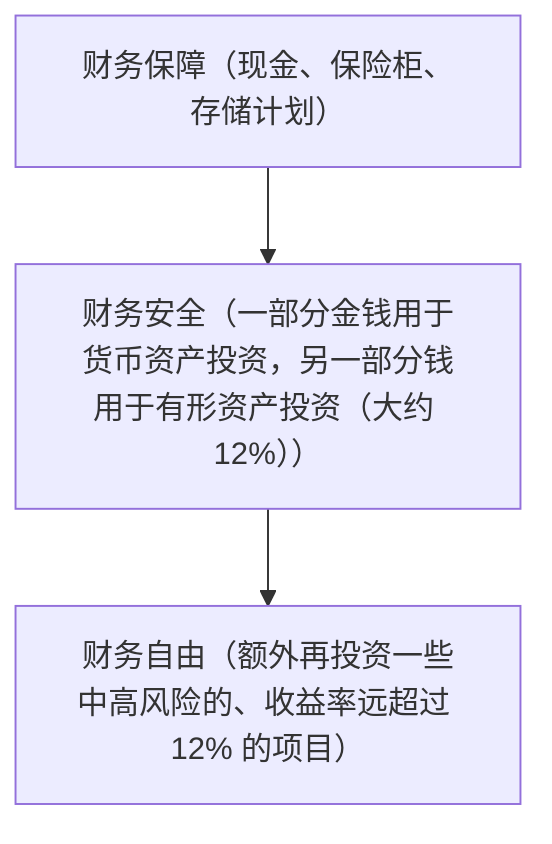

[TOC]

-------

每个人都有权利去实现自己的财富梦想，你也不例外。但为了让梦想成为现实，首先，你必须对目标要有一个准确的认识。

### 第一步计划：财务保障

请回答一个问题：假设你突然断了经济来源，欠你钱的人无法还钱；或者公司破产，你被解雇了；或者你生病了——这样的情况下，你能支撑多长时间？

这正是我们要谈到的财务保障。尽管遭遇突如其来的经济变故，你还是能依靠积蓄继续保障自己的生活。

#### 你需要多长时间的财务保障

需要多少个月的财务保障，取决于你的保障需求和你的乐观程度。

没人能保证自己在意外和不幸来临时不受伤害。但是我们可以未雨绸缪，让我们在意外发生时，能够从容面对。如果意外来临时，我们还要面临财务危机，或者是因为财务问题而妥协，那才是真正的不幸。

#### 为你的企业做好财务保障

在德国，80% 的公司都会在前 5 年内破产。破产的主要原因是缺乏资金。

要给你的企业准备足够的财务保障，不到万不得已，不去碰这笔资金。

#### 但我想投资······

**投资好，但抓准时机投资会更好**。

经济运行是周期性的。下一次经济衰退会不可避免地发生。假设你面前是个经济低谷，也许你的公司会淹没在这个低谷中，如果这时你刚好有足够的资金，就去抓住机会。没有哪个时期比经济衰退期更适合投资。但手上有资金才行。

#### 实现财务保障需要多长时间

这里有一个简单的规则：**目标越小，实现的速度越快**。

3 个理由说明小的财务保障目标更有利：
1. **第一个目标较小时，你能更快地实现**。
2. **你每月开支越少，结余越多，越能更快地实现自己的财务保障计划**。
3. **你能坚持下去，是因为第一个目标让你感觉触手可及**。

#### 预算计划

每个人都应当定期算一算，好让自己清楚每个月到底有多少开销，看看把钱都花到了哪些地方。只要你还没有实现财务保障，你就必须得考虑对预算进行计划。

#### 如果预算计划不是你的强项

在制订预算计划方面有一个公认的说法：**为你的强项找一位教练，给你的弱项找一个解决方案**。

**不要在一些不重要的事情上成为专家，或者做事情不要本末倒置**。

尽可能快地实现财务保障。
- 世界上不可能有人从来都没有实现过自己的最低目标
- 你对自己，对你的健康，你的家人和你的自我价值是负有责任的
- 随之而来的是：你在财务上会获得安全感
- 把这笔钱存放在安全且容易支取的地方
- 你以此奠定了富裕生活的基石
- 由此你已经达到了真正自由的最低限度

#### 要么开源，要么节流

本杰明·富兰克林有一个很恰当的描述：

“有两条通向幸福的道路：降低要求或者增加财富。两者导向的目标是相同的。不同的只是每个人会根据自身习惯选择出最适合自己的捷径。”

“在你生病或者生活穷苦潦倒时——你立马就会体会到，降低要求会有多艰难，更不易的是，增加资本。”

**开始阶段简单的事情以后会变得困难，开始阶段困难的事情以后也会变得简单**。储蓄并不难，但由于这对你而言是一项全新的开始，所以在开始阶段你应该会感到十分陌生。

#### 你要用这笔资金为实现财务保障做些什么

你需要一个计划和相应的思想来管理你的资金。

#### 可口可乐的故事

这样的区别是如何产生的呢？那就是对资金的持有！不要让你的金钱从指缝中化为乌有。至少牢牢抓住其中一部分。那么不只是在财务上，你将在各方面都取得回报。

### 第二步计划：财务安全

第一项计划财务保障能给你带来很多的益处：你可以安全地渡过一次危机，你会感到有安全感，可以时刻准备好面对一些未知的意外。

但是财务保障有一个很大的缺点：一旦意外情况发生，你会花光所有的积蓄。虽然你在财务上安然无恙地渡过了一次危机，但是你的积蓄都没了。

真正保险的办法是，你需要积累足够的资金，使你可以靠利息生活。

#### 你需要多少资金

现在你计算出了保障每月生活所需的最低金额。也就是说，你知道每个月需要的这颗金蛋有多大。由此也能算出要养一只多大的“鹅”。

假设 8% 的纯收益，财务安全公式为：

每月所需金额 X 150 = 资金总额

假设你只能再活 6 个月，你还想做哪些事情呢？你想去哪些地方？你想和哪些人在一起？想做哪些事情生存下去？

也许你远远不止活 6 个月份，但你不可能永生。**如果不是金钱，那又是什么在阻碍你去做这些对你而言十分重要的事情？**你看，不给予金钱恰当的关注度是多么危险的一件事情。你应该让自己享受美好的生活。

#### 你欠自己一份财富

尽快去实现你的财务安全。
- 一旦实现自己的财务保障，你就应该将所有可用资金用来投资，以实现财务安全
- 当你实现了财务安全之后，你就不应该再去动用自己的本金了
- 你住你想住的地方，做你喜欢的事情，仍然可以把所有账单付清
- 除此之外，你还可以致力于自己感兴趣的、与你的才能相符的事情
- 你应该将克莱门特·斯通的名言作为自己的信条：“一个存不下钱的人，没有资格被称作一个聪明、理性的人。”
- 你有两种选择：
  - 让时间为你工作，在 20 年内逐步轻松实现自己的目标
  - 你可以按照第七章中的方法来努力

生活是没有借口的。你应该做的就是负责。你掌握自身的生活。你可以随时改变你的信仰。你可以接受新的观点。那么，现在谈谈梦想。

### 第三步计划：财务自由

你是否知道大多数人之所以实现不了自己的梦想，就是因为他们从来没有考虑过他们应该为此做些什么。**他们不知道，他们需要为自己的梦想付出多少**。

#### 绝不动用你的本金

首先，我们必须澄清一条重要的原则：你永远不能杀你的“鹅”。你也不能将它切割成小块。绝不能动用你的本金。你所有的梦想，能借助金蛋来满足。这也意味着，你的金蛋必须大到足以承担你的梦想。

#### 如何计算梦想所需的花费

1. **首先，将你所有的愿望列出来**
2. 逐条列完之后，**再在每一条后面写上大概的置办费用**
3. 但是请记住，永远都不能动用你的“鹅”资金。因此，你必须采取分期付款的方式来置办所有的大件。现在**计算一下，每件置办物的月付额是多少**
4. 将你实现财务自由之后仍然存在的**所有日常支出列出来**。针对这笔支出，你应该使用你的利息进行支付。

#### 你的投资策略

##### 实现财务保障不要去冒险

最重要的标准便是金钱的可支配性。你必须每天都有金钱收入。因此，你最好将你的金钱放进保险箱或是投入现金基金当中。在你实现财务保障之前，你都不应该去冒险。

因此，你应该选择低风险的投资项目。但就算是这样，你还是要注意管控可能出现的风险。永远不要将你所有的金钱全都投进一个投资项目中，即使“你全部的资金”加起来只有 1 000 欧元。**记住，对风险的管控就意味着盈利机会的增加**。

##### 40:40:20 原则保证财务安全

要实现财务安全，你就必须改变金钱的投放比例。

低风险 ： 风险适度 ：风险较高

重要的一点是：**你千万不能将用于保证你财务安全的金钱投进高风险或是投机性质的项目**。你千万不要动用这笔钱。你进行的投资必须保证你的财务安全永远不会受到影响。

##### 50% 中风险，50% 高风险，实现财务自由

实现财务安全之后，你就应该抽取一部分金钱以实现财务自由。也就是说，你也得冒较大的风险。

我们可以用 3 个水壶来进行概括：

**注意：**只有当第一个水壶被注满之后，你才能加注第二个水壶。你只能使用第二个水壶中盈余的部分（你不需要用来实现财务安全的金钱）来对第三个水壶进行加注。这样，你的财务安全就永远不会承担风险。

如果你遵循这一投资哲学的话，就不会存在失败了。你会永远处于安全之地，而且有机会实现你所有的梦想。

##### 定好目标，你成功了一半

现在需要走出决定性的一步：你必须做出一个明确的决定。你真的想要实现财务自由吗？你愿意承担与此相关的责任吗？

你准备好持续跟踪并更新你所列出的清单，一直到它成为你生活中不可或缺的一部分了吗？

在你做出明确的决定之前，请不要继续再读下去。这个决定应该包含你实际做的你所了解的必要之事。你知道，你首先必须着手改变信仰。你必须将巨大的痛苦与目标无法实现联系在一起，将巨大的快乐与目标得以实现联系在一起。

你应该意识到为什么你一定要这样生活。记住：你必须每天提升自己，全力以赴。你必须不断地学习和成长。你必须付出 110% 的努力。你必须全力以赴，成为最好的自己。

你真的想要这样吗？你真的愿意为了财富和幸福去付出每个人都必须付出的代价吗？如果你决定好了这样做（我也想鼓励你这样做），你就负有责任了：**你应该向自己承诺，不到最好，永不满足**。

当你为自己定好一个目标，制订出书面的计划，你就已经成功 50% 了。以下也有 4 个足以证明这一点的重要原因：

1. 目标拓宽你的机会意识

当你做下这个承诺，你会换一种角度去观察出现在你生活中的每一个人。每一种处境对你来说都有其存在的意义。不断地问自己：它能对我实现目标有什么帮助？我怎样才可以马上将它运用起来？

你对目标的定义越清晰，你的承诺越有效，你就能越多地利用这两个起决定作用的问题：这如何与我的情况相符呢？我应该如何马上采取行动呢？

2. 目标为你指出解决问题的方向

大多数人都将自己的时间浪费在长时间思考问题上。目标清晰的人没有时间这样做。他们想要更接近自己的目标，因此不断地寻找解决方法和解决途径。他们将精力集中于目标之上。一旦一个人将自己的视线聚焦于一个目标，那么恐惧就打不倒他。

3. 目标使你为了“赢”而去比赛

**我们参加比赛是为了不输，还是为了赢，两者之间有着天壤之别**。你结识某个人，马上就能感觉出来他是一个不想输的人，还是一个想要赢的人。你能从他的眼神、行为、话语判断这一点。

远大的目标不允许我们只是苟且地存活着。你必须全力以赴。你必须为了“赢”而活着。

4. 你有了一个目标，一切都变得很重要

无目标之人的生活座右铭都是：只是一点点不好的东西并不会对我造成伤害。而对于有目标的人来说，一切东西、任何一个小细节都十分重要。

从你拥有目标的这一刻起，一切都会变得重要起来。你所做的一切不是在使你接近目标，就是在使你远离目标。不存在中间状态。

正如之前所说的：一个明智的决定是成功的前提。如果一个人说“我可以过一会儿再做决定”，那么他就是在欺骗自己。**因为如果你（现在）不做决定，就意味着你已经做好了决定**。

你决定让一切照旧，不去做任何改变。你决定继续远离自己的目标。所以，现在就做出决定吧！

##### 财务自由很难实现吗

我认为你应该知道答案的。是的，很难。但是，不去实现财务自由，会更难。继续提升自己很困难。但是，慢慢地死去更苦。生活在这个世界上，不知道自己有多大能力，这是很不好的。只有全力以赴之后，我们才能感觉出来，生命真正的意义是什么。之后我们才能完成自己的使命，之后我们的生活才有了意义。

区分人和人并最终造成差距的东西，是满足和惰性。我们永远不能安于现状。

**我们的使命不是去谈论或梦想这样一个没有沼泽的世界，而是去实现它**。我们需要高尚的人，需要说什么就做什么的人，需要实现自身梦想的人。

##### 不应该让恐惧左右你的决定

你知道阻碍大多数人去过自己梦想生活的东西是什么吗？是恐惧，恐惧犯错，恐惧失败，恐惧丢脸，恐惧使自己和他人失望，恐惧做出错误的决定。

恐惧永远不应该左右你的决定。因为世界上不存在失败。是的，你没有看错：世界上不存在失败。

世界上不存在失败，只存在结果。在我做的咨询活动中，恐惧失败对至少 70% 的人来说都是最大的心理障碍。不过，我们可以毫不怀疑地说，这个世界上几乎所有巨大的成功都是在失败之后才产生的。

是时候改变我们对待失败和错误的态度了。因为许多人被其阻碍而不能以胜利者的身份去闯荡天下。

##### 错误是有益的

我们必须采取行动，不要害怕犯错误。我们不应该成为从不犯错的人，而应该成为永不放弃的人。

对于放弃了的人，人们回想起来，只会认为他是一个失败者，而对于那些坚持不懈的人，人们脑海中只记得他是一个优秀的人物。这里讲的并不是要去避免错误，而是说不要让任何事或任何人阻碍你去走自己的路。**他人可以短暂地阻止你，但只有你自己才可以永远地使自己停下来**。

##### 你真的想实现财务自由吗

你必须做的不仅仅是储蓄和投资。仅仅是走向正确的方向还不够，你必须在正确的道路上做出一个巨大的飞跃。

同时，你对错误和风险的恐惧，永远不应该促使你按照最低要求去生活。因为只有全力付出时，我们才会真正感到满足。

##### 什么都不做的人才不会犯错

我的最后一位导师说过：“如果你不经常犯错，表明你冒的风险不够，没有付出最大的努力。”

通向成功的道路上布满荆棘。只有一路前行，不惧怕错误，生活才会将五彩缤纷展示在我们面前。之后我们才会知道，这一切就是命运的安排。

我们所经历的一切也都有其意义。我们所有的经验和经历都会化成一股力量，汇入我们正要完成的使命中。一切都有其意义。我们只需要识别出这些意义。

我们所犯过的每一个错误，都会对我们有所帮助。

每一个我们过去认识过的人，都会指引我们去认识新的人，获得新的机会。

但是要识别出这其中的关联，主要还是在于我们自己。

这一切都有一个前提：我们必须克服各种类型的恐惧，持续学习和成长。

这样一个态度带给你的回报，会超越你所有的期待。

请现在就做出决定，你是否想实现财务自由。
- 不到最好，永不满足
- 你应该提升你对机会的感知能力
- 你参加比赛是为了赢得比赛
- 每一件小事都有其对你有利的意义。一切都十分重要
- 你的生活准则应该是：成为最好的自己
- 你不应该害怕犯错误
- 想要变得十分富有，你就必须建立自己的企业

-------
